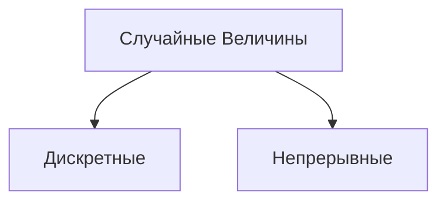

## Случайная величина

Случайная величина - это функция, которая сопоставляет каждому элементарному исходу случайного эксперимента некоторое численное значение.

1. Дискретные случайные величины принимают только конечное или счетное число значений (например, число выпавших очков на игральном кубике).
   
2. Непрерывные случайные величины, напротив, могут принимать любое значение из некоторого интервала (например, время прохождения автомобиля определенного расстояния).

## Функция распределения
Законом распределения СВ называется любое правило (таблица, функция), позволяющее находить вероятности всех возможных событий, связанных с СВ.

Некоторые свойства функции распредления $F(x)$:

1. $0≤F(x)≤1$, так как $F(x)$ - вероятность
2. $F(−∞)=0$
3. $F(∞)=1$

## Дискретные случайные величины

### Пример:
Пусть опыт $G$ состоит в подбрасывании двух монет, а элементарным событием $ω$ является положение упавших монет. Тогда число выпавших «гербов» - это случайная величина $X(ω)$ с конечным числом возможных значений $\{0,1,2\}$, т.е. является дискретной случайной величиной.

Простейшей формой закона распределения дискретной СВ является ряд распределения $pk≜P{X=x_k}, k=[0,n]$, который задается аналитически или таблицей:

|$X$|$x_0$|$...$|$x_n$|
|-|-|-|-|
|$P$|$p_0$|$...$|$p_n$|

Здесь в верхней строке расположены по возрастанию все возможные различные значения $x_0,...,x_n$ дискретной СВ $X$, а в нижней — соответствующие им вероятности $p_0,...,p_n$.

условие нормировки:
$p_0+...+p_n=1$

## Плотность вероятности, непрерывные случайные величины
Плотность вероятности – это функция, которая описывает распределение вероятности непрерывной случайной величины. Плотность вероятности показывает, как вероятность распределена по значениям случайной величины. 

Фактически, плотность вероятности является производной функции распределения вероятности и определяет вероятность того, какое значение случайная величина примет в определенном интервале.

$$F_X(x)=\int\limits_a^b f(x)\,dx$$
$$F^\prime(x)=f(x)$$
где $f(x)$ - плотность вероятности функции

СВ, у которой существует плотность вероятности, называется абсолютно непрерывной.

Свойства плотности вероятности $f(x)$:
1. $\int\limits_{-∞}^{+∞} f(x)\,dx=1$
2. $f(x)≥0$
3. $\int\limits_{x_1}^{x_2} f(x)dx=P\{x_1≤X≤x_2\}$

## Математическое ожидание

Математическое ожидание - это среднее значение случайной величины, которое можно ожидать при многократном проведении опытов. Оно позволяет описать ожидаемое поведение случайного процесса или эксперимента, и на его основе можно принимать решения в условиях неопределенности.

1. Для дискретной СВ $X$ математическое ожидание определяется как сумма произведений каждого значения $x_k$ случайной величины на его вероятность $p_x$:

$$M[X]≜M[X]≜\sum\limits_{k=0}^np_kx_k$$
$$p_k≜P\{X=x_k\}$$

2. Для непрерывной СВ $X$ математическое ожидание определяется как:
$$M[X]≜\int\limits_{-∞}^{+∞}xf(x)dx\$$

## Дисперсия
Дисперсия - это мера разброса случайной величины от ее математического ожидания. Она показывает, насколько сильно значения случайной величины отклоняются от ее среднего значения и используется для определения степени изменчивости данных.

Средним квадратическим отклонением (СКО) СВ $X$ называют величину $σ_X≜\sqrt{D[X]}≥0$.

Свойства математического ожидания $M[X]$ и дисперсии $D[X]$:
1. $M[c]=c$
2. $D[c]=0$
3. $M[cX]=cM[X]$
4. $M[X+c]=M[X]+c$
5. $|M[X]|≤M[|X|]$
6. $D[X]=M[X^2]−M[X]^2$
7. $D[cX]=c^2D[X]$
8. $D[c+X]=D[X]$

## Характеристическая функция

Характеристическая функция (ХФ) - это функция, определяющая свойства распределения случайной величины. Характеристическая функция определяется как математическое ожидание экспоненциальной функции комплексного аргумента, умноженной на случайную величину X:

$g_X(t) ≜ M[e^{itX}]$, где $i$ - мнимая единица, $t$ - действительный параметр.

1. Если СВ X - непрерывная, то:
   $$g_X(t)=\int\limits_{-∞}^{+∞}e^{itX}f(x)dx\$$
2. если СВ X - дискретная, то:
   $$g_X(t)=\sum\limits_{k=0}^np_ke^{itX}$$

## Квантиль

Квантилью уровня $p$ функции распределения $F(x)$ СВ $X$ называется минимальное значение $x_p$, при котором функция распределения $F(x)$ не меньше значения $p$, где $p∈(0,1)$, т.е.

$x_p≜min\{x:F(x)≥p\},p∈(0,1)$

На рисунке указаны квантили уровней $α$, $β$ и $γ$ некоторой функции распределения $F(x)$
